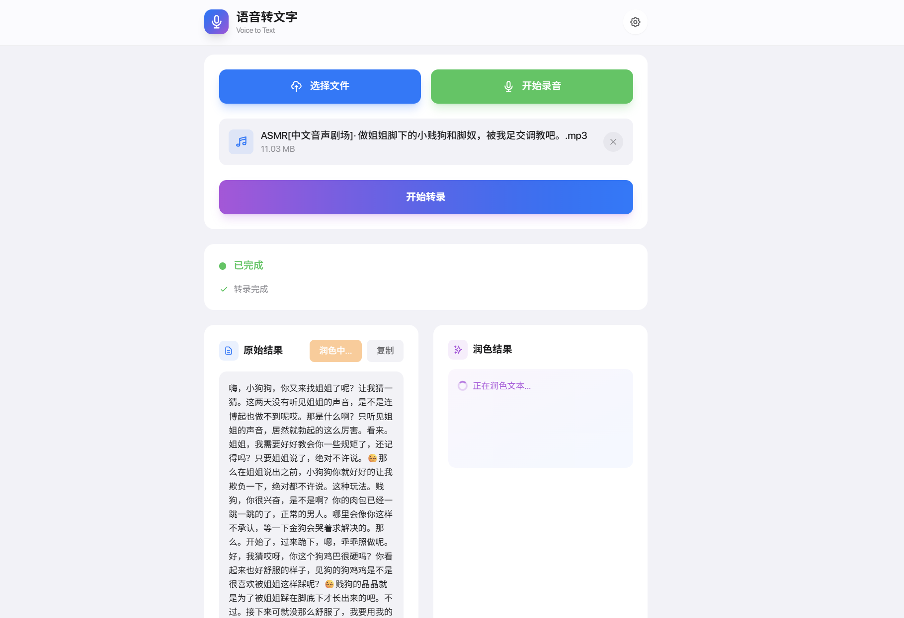

# 🎙️ 语音转文字工具

> 最终是想要 [橘鸦Juya](https://space.bilibili.com/285286947)  音色 来搞 定制化 ASMR，想想牛牛就硬硬的 🥵🥵🥵 


一款简洁优雅的语音识别与文本润色工具，采用 Apple 风格设计，支持音频文件上传和实时录音。




## 📋 TODO

- [ ] 增加音频来源，支持从 [asmrgay.com](https://asmrgay.com/asmr) 链接在线导入
- [ ] 做更多模型适配，探索更多 Audio-to-Text 模型
- [ ] 扩充功能：识别后由 AI 定制仿写 ASMR 内容，并通过音色克隆进行 TTS

## ✨ 特性

- **语音识别** - 支持上传音频文件或直接录音，调用硅基流动 ASR API 进行高精度语音转文字
- **智能润色** - 内置免费 LLM 润色服务，自动纠错、添加标点、分段排版
- **自定义润色指令** - 可自定义润色规则，适配不同场景（会议记录、采访整理、翻译等）
- **设置持久化** - 所有配置自动保存到浏览器 localStorage，下次打开无需重新填写
- **实时进度** - 详细的上传进度、处理状态和运行日志
- **Apple 风格 UI** - 圆润卡片、毛玻璃效果、流畅动画，简洁美观

## 🚀 部署方式

### 方式一：本地运行

```bash
# 克隆项目
git clone https://github.com/zhu-jl18/ASMR-Transformer.git
cd ASMR-Transformer

# 安装依赖
npm install

# 启动开发服务器
npm run dev
```

打开浏览器访问 http://localhost:3000

### 方式二：Docker 部署（推荐生产环境）

```bash
docker compose up -d --build
```

访问 http://your-server:3000

## 🔧 配置说明

### 语音识别 API（必填）

使用硅基流动提供的免费 ASR 服务：

1. 访问 [硅基流动官网](https://siliconflow.cn) 注册账号
2. 在控制台获取 API Key
3. 在工具设置中填入 API Key

默认配置：
- API URL: `https://api.siliconflow.cn/v1/audio/transcriptions`
- 模型: `TeleAI/TeleSpeechASR`

### 文本润色 API（可选）

工具内置了免费不限量的润色服务，开箱即用，无需配置。

如需使用自己的 LLM API：
- 支持任何 OpenAI 兼容的 API（如 OpenAI、DeepSeek、通义千问等）
- 在设置中填写 API URL、模型名称和 API Key

### 自定义润色指令

可在设置中修改润色指令，例如：
- 默认：纠错、添加标点、分段排版
- 会议记录：提取要点、整理成会议纪要格式
- 翻译：将内容翻译成英文

## 📁 项目结构

```
├── app/
│   ├── api/polish/route.ts   # LLM 润色 API 代理
│   ├── globals.css           # 全局样式（Apple 设计系统）
│   ├── layout.tsx            # 根布局
│   └── page.tsx              # 主页面组件
├── docs/
│   └── image-1.png           # 界面截图
├── Dockerfile                # Docker 构建配置
├── docker-compose.yml        # Docker Compose 配置
└── package.json
```

## 🛠️ 技术栈

- **框架**: Next.js 15 (App Router)
- **语言**: TypeScript 5.7
- **UI**: React 19 + Tailwind CSS 3.4
- **部署**: Vercel / Docker / Node.js

## 📝 使用流程

1. 点击设置图标，填入硅基流动 API Key
2. 选择音频文件或点击录音按钮
3. 点击「开始转录」等待识别完成
4. 查看原始结果，点击「润色」进行智能排版
5. 复制润色后的文本使用

## 🤝 贡献

欢迎提交 Issue 和 Pull Request！

## 📄 License

MIT
